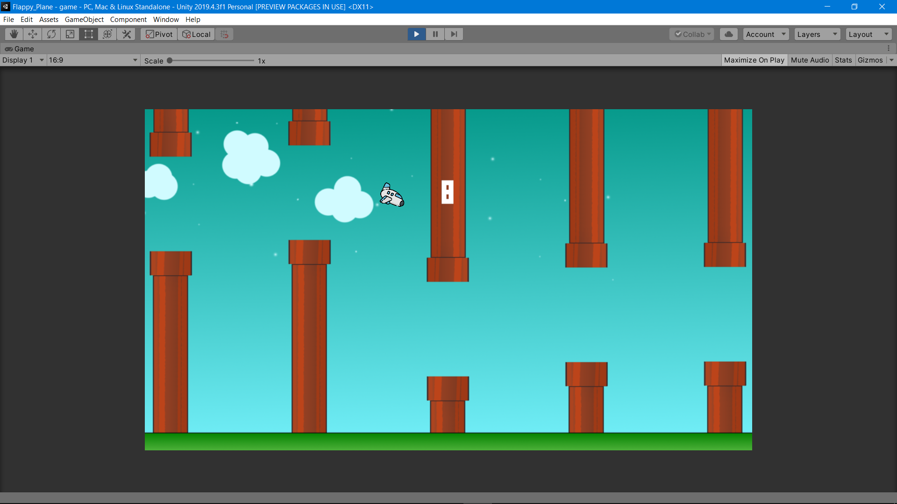

# Code Starter 3 - Game Development

1. __Download VS Code (Visual Studio Code)__

    - Download: [https://code.visualstudio.com/](https://code.visualstudio.com/)

    - Visual Studio Code merupakan general code editor populer produksi Microsoft.

    - Bahasa yang digunakan: __C# Programming Fundamental__

    - Penggunaan C#:
        
        - Backend website development
        - Mobile application
        - Games development

<hr>

2. __Materi C# Fundamental__:
    1. Setup & First Code
        - Installation
        - Setup
        - Syntax

    2. Variables & Data Types
        - string
        - int
        - long
        - float
        - double
        - bool
        - char
        - Array

    3. User Input
        - WriteLine
        - ReadLine

    4. Operators
        - Arithmetic Operators
        - Assignment Operators
        - Comparison Operators
        - Logical Operators

    5. Conditions & If Statement
        - If ... Else
        - Switch

    6. Looping
        - While Loop
        - For Loop

    7. Method
        - Method
        - Parameters
        - Overloading

    8. OOP / Object Oriented Programming
        - Objects
        - Classes
        - Inheritance

<hr>

3. __Download Unity__:

    - Download: [https://unity3d.com/get-unity/download](https://unity3d.com/get-unity/download) 

    - Materi __Unity__:

        1. Installation
            - Unity overview
            - Unity's basic concept
            - How to code

        2. Game Assets
            - Environment (Stage & Terrain)
            - Characters
            - Audio & Music
            - Animation
            
        3. Unity GUI
            - Buttons, sliders, toggles
            - Labels, boxes
            - Text entry
            - Windows
            - Widget
            - GUI Skin

        4. Triggers, collisions & polishing
            - Triggers
            - Collisions
            - Polishing (light, shadow)
            - Finishing (effects: smoke, stardust)

        5. Publishing

<hr>

4. File ekstensi __C#__ adalah __.cs__ atau __.csx__. Beberapa cara running C# via terminal:

    - Default: ```csc``` command (__.cs__)
    - Aplikasi .NET: ```dotnet``` command (__.cs__)
    - Modern ```scriptcs``` command (__.csx__)

<hr>

5. __Demo Unity 2D & 3D__

    - Flappy Plane

        

    - 3D Shooter

        

<hr>

#### Lintang Wisesa :love_letter: _lintangwisesa@ymail.com_

[Facebook](https://www.facebook.com/lintangbagus) | 
[Twitter](https://twitter.com/Lintang_Wisesa) |
[LinkedIn](https://www.linkedin.com/in/lintangwisesa/) |
[Youtube](https://www.youtube.com/user/lintangbagus) | 
:octocat: [GitHub](https://github.com/LintangWisesa) |
[Hackster](https://www.hackster.io/lintangwisesa)